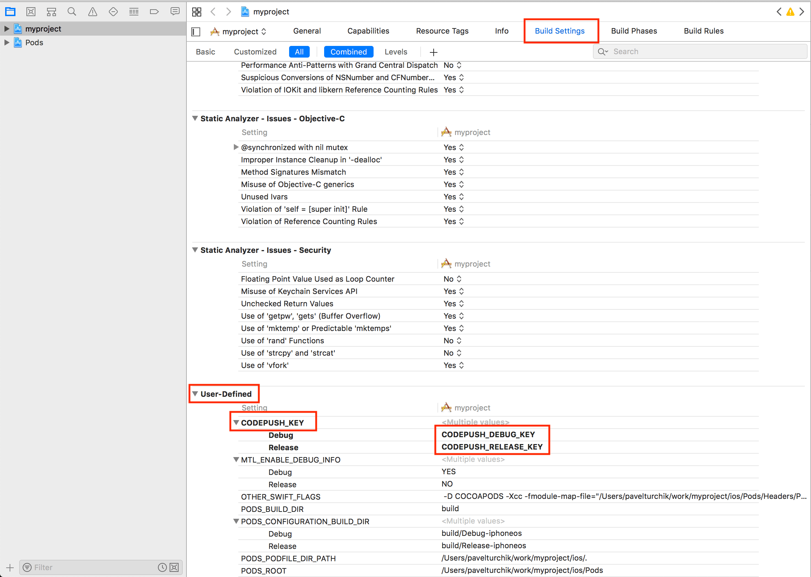

# CodePush setup

[CodePush](https://github.com/Microsoft/react-native-code-push) is a cloud service that enables React Native developers to deploy mobile app updates instantly to all the devices of users.

It's built-in into the [`@startupjs/app`](/packages/app), which is included to the [`routing` template](#boilerplate-templates).

Do the following steps to configure it for your project:

1. Install CodePush CLI
  ```
  npm install -g code-push-cli
  ```
2. Create/Login a CodePush account
  ```
  // Register
  code-push register

  // Login if registered already
  code-push login
  ```
3. Register your app
  ```
  // For Android
  code-push app add <App-Name-Android> android react-native

  // For iOS
  code-push app add <App-Name-Ios> ios react-native
  ```

## Android

1. Add empty `reactNativeCodePush_androidDeploymentKey` string item to `/path_to_your_app/android/app/src/main/res/values/strings.xml`. It may looks like this:

```xml
<resources>
  <string name="reactNativeCodePush_androidDeploymentKey" moduleConfig="true"></string>
  <string name="app_name">Lingua.Live</string>
</resources>
```

2. Get keys using `code-push deployment ls <App-Name-Android> --displayKeys` and copy both Debug and Release key in `/path_to_your_app/android/app/build.gradle`


3. Go to `/path_to_your_app/android/app/src/main/java/com/lingua/MainApplication.java` and add code which set keys. It may looks like this:

```java
@Override
protected List<ReactPackage> getPackages() {
  @SuppressWarnings("UnnecessaryLocalVariable")
  List<ReactPackage> packages = new PackageList(this).getPackages();
  // Set CodePush deployment keys here, because
  // we can't set different keys for debug and
  // release on strings.xml (reactNativeCodePush_androidDeploymentKey)
  for(ReactPackage reactPackage: packages) {
    if (reactPackage instanceof CodePush) {
      ((CodePush)reactPackage).setDeploymentKey(BuildConfig.CODEPUSH_KEY);
    }
  }
  return packages;
}
```

## iOS

1. Add `CodePushDeploymentKey` string item with value `$(CODEPUSH_KEY)` to `/path_to_your_app/ios/your_app/Info.plist`. It may looks like this:

```xml
<plist version="1.0">
<dict>
<!-- ...other configs... -->
<key>CFBundleVersion</key>
<string>1</string>
<key>CodePushDeploymentKey</key>
<string>$(CODEPUSH_KEY)</string>
<key>LSRequiresIPhoneOS</key>
<!-- ...other configs... -->
</dict>
</plist>
```

2. Get keys using code-push deployment ls <App-Name-Ios> --displayKeys then open `/path_to_your_app/ios` using `Xcode` and copy both Debug and Release key in



## References

- [Generating keystores](https://coderwall.com/p/r09hoq/android-generate-release-debug-keystores)
- [CodePush](http://microsoft.github.io/code-push/docs/cli.html)
- [Checklist for deploying app](https://medium.com/the-react-native-log/checklist-to-deploy-react-native-to-production-47157f8f85ed)
